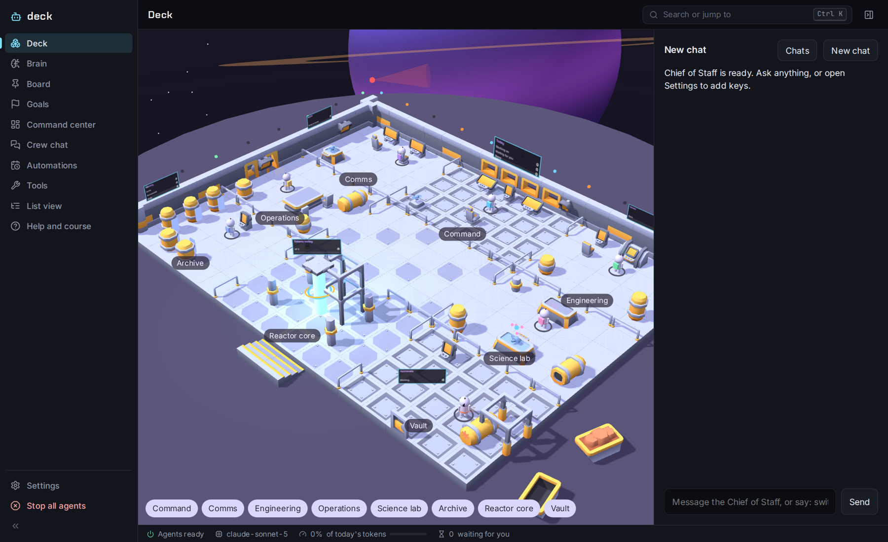
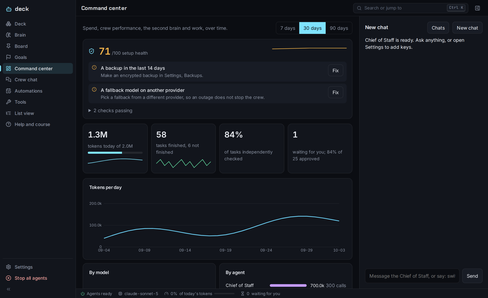
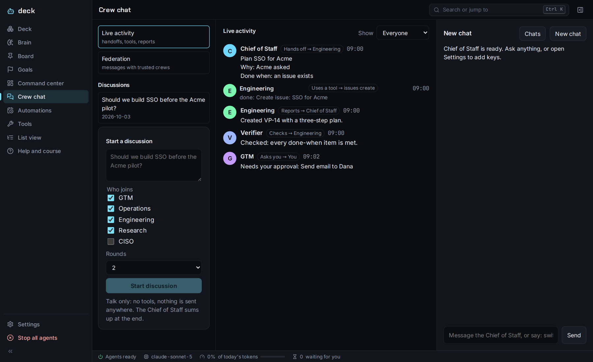
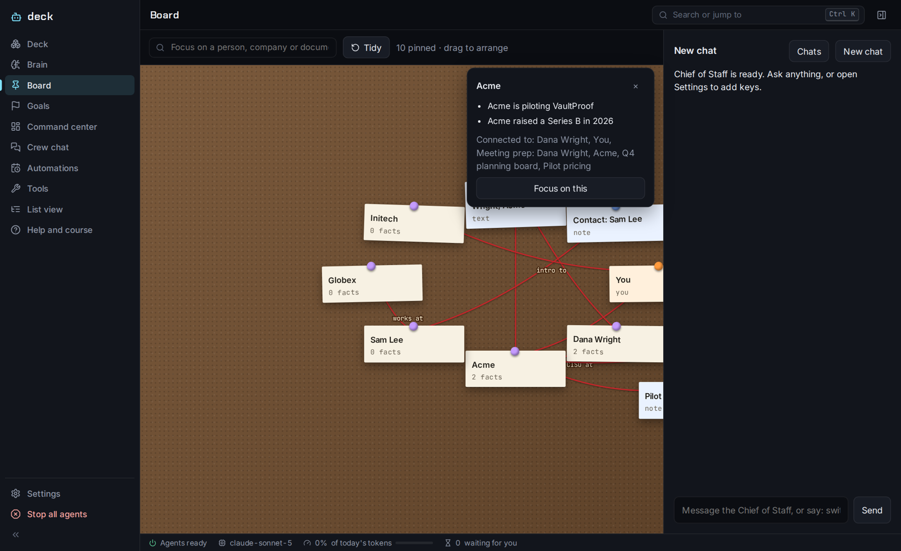
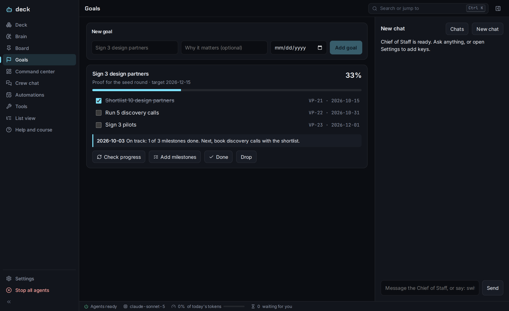
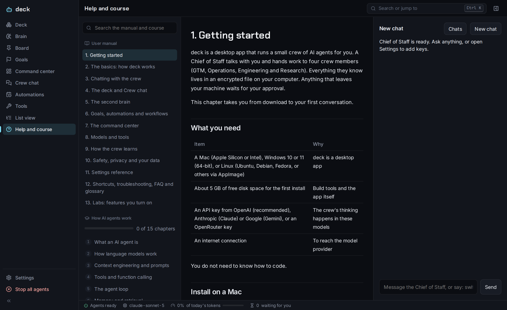
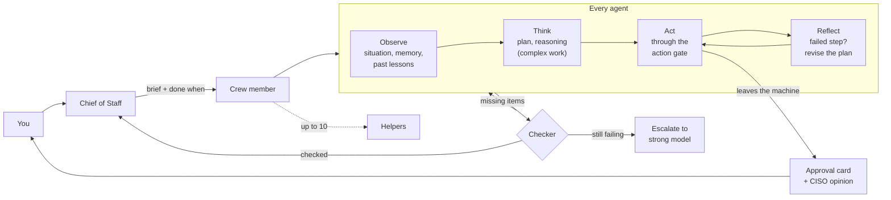
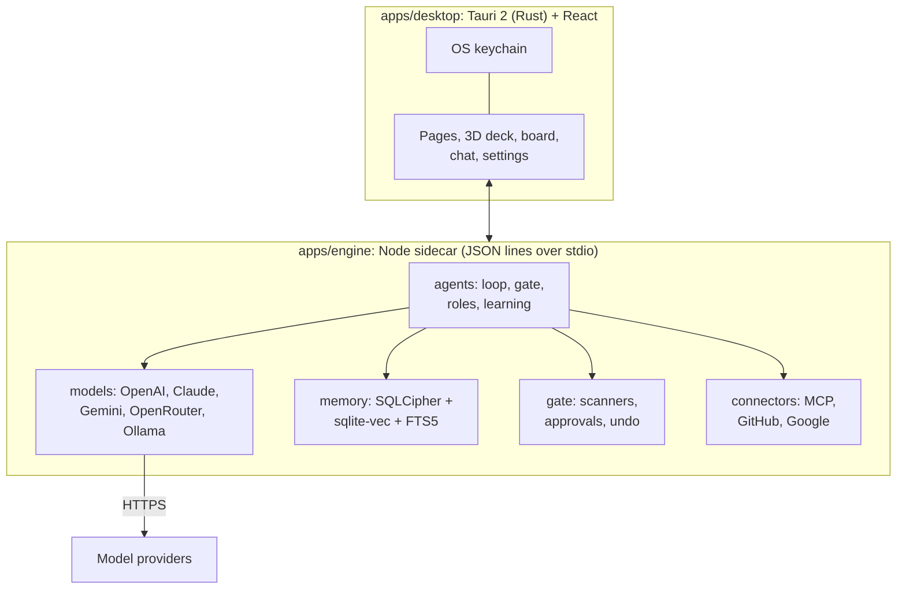

<div align="center">


# deck

**Your local-first AI crew.** A Chief of Staff that plans, remembers and delegates to specialist agents,<br>
with encrypted memory on your machine and your approval on anything that leaves it.

[](LICENSE)
[](#install)
[](https://tauri.app)
[](#development)
[](#evals)
[](#evals)
[](#models)
[](https://modelcontextprotocol.io)
[](CONTRIBUTING.md)

[Install](#install) · [Features](#features) · [How it works](#how-it-works) · [Safety](#safety) · [Docs](#docs) · [Roadmap](#roadmap)



</div>

<a id="highlights"></a>

## ✨ Highlights

<table>
<tr>
<td width="33%" valign="top"><b>🧭 A crew, not a chatbot</b><br>A Chief of Staff delegates to GTM, Operations, Engineering, Research, a CISO and up to 8 agents you define. Agents can spin up temporary helpers for parallel work.</td>
<td width="33%" valign="top"><b>✅ Work that gets checked</b><br>Every task has a "done when" list. A separate model checks the result, retries once with what was missing, then escalates to a stronger model.</td>
<td width="33%" valign="top"><b>🔐 Local and encrypted</b><br>Memory, chats and documents live in one SQLCipher file. Keys stay in your OS keychain. Encrypted backups restore anywhere with your passphrase.</td>
</tr>
<tr>
<td valign="top"><b>🧠 Memory that learns</b><br>Hybrid search, history when facts change, failure lessons, an evolving playbook per agent, approved skills, nightly learning and tested prompt tuning.</td>
<td valign="top"><b>🛡️ Safe by design</b><br>Approval for anything external, a CISO opinion on every approval, an input scanner, a plan lock, a tripwire, and safety evals that assume the model is hijacked.</td>
<td valign="top"><b>🔎 Research that cites</b><br>Web research with sources, research swarms that search several angles at once, and meeting prep briefs from professional sources.</td>
</tr>
<tr>
<td valign="top"><b>📚 A second brain</b><br>Files, web pages, Obsidian, Notion, Apple Notes, notes with links, and camera capture of cards, whiteboards and documents. Explore it in 3D or on a corkboard.</td>
<td valign="top"><b>🎯 Goals and automations</b><br>Goals become milestones with weekly check-ins. Jobs run on a schedule. Workflows chain agents step by step.</td>
<td valign="top"><b>✅ Verified skills hub</b><br>Signed, checked skills: no download-and-run steps, hidden payloads, credential theft or planted keys. Instructions only; scripts never run.<br><br><b>📦 OpenClaw import</b><br>Bring over memory, persona, heartbeat and skills. Credentials are never read.<br><br><b>⚡ Jev decisions</b><br>Optional TypeSafe AI integration: fast, calibrated yes/no and pick-one answers for routing, first-pass checks, approval risk and injection scanning, each falling back when unsure.<br><br><b>🧪 Labs</b><br>Local models with Ollama, MCP plugins, Gmail and Calendar, GitHub pull requests, crew votes, federation with trusted crews. All off until you turn them on.</td>
</tr>
</table>

## 📸 Screenshots

<table>
<tr>
<td width="50%"><br><sub><b>Command center.</b> Setup health with fixes, spend, crew performance and growth.</sub></td>
<td width="50%"><br><sub><b>Crew chat.</b> Every handoff, tool call, check, thought and approval, live.</sub></td>
</tr>
<tr>
<td><br><sub><b>Board.</b> People, companies, facts and documents pinned and connected.</sub></td>
<td><br><sub><b>Goals.</b> Milestones as issues, progress, and weekly check-ins.</sub></td>
</tr>
<tr>
<td colspan="2"><br><sub><b>Help and course.</b> The full manual and a 15-chapter course on how AI agents work, with quizzes.</sub></td>
</tr>
</table>

<a id="install"></a>

## 🚀 Install

> Requires macOS (Apple Silicon or Intel), Windows 10/11 64-bit, or Linux; about 5 GB free for the first install; and an API key (OpenAI recommended; Anthropic, Gemini and OpenRouter also work). No coding needed.

<table>
<tr><th>macOS</th><th>Windows</th><th>Linux</th></tr>
<tr>
<td valign="top">

1. Unzip `deck.zip`
2. In Terminal: `bash ` then drag in **Install deck.command**
3. Wait 10 to 20 minutes the first time

</td>
<td valign="top">

1. Properties → **Unblock**, then unzip
2. Double-click **Install deck.cmd**
3. Wait 20 to 40 minutes the first time

</td>
<td valign="top">

1. Unzip
2. Run `./install-linux.sh`
3. Gets a `.deb`, `.rpm` or AppImage

</td>
</tr>
</table>

Installers keep their own Node and Rust in `~/.deck-tools` (Windows: `%LOCALAPPDATA%\deck-tools`) and write a readable log. Updating keeps your memory, settings and keys. Uninstallers only delete data if you type `DELETE`. Prebuilt `.dmg`, `.msi`, `.deb` and AppImage files come from the release workflow when a version tag is pushed.

**First run:** a power-up check lights each system, then a short setup: paste your OpenAI key (deck picks the newest reasoning model and mini automatically), choose a starting pack, tell the crew about you, choose how much it should ask, and save your recovery key.

<a id="features"></a>

## 🧩 Features

### The crew

| Agent | Role | Hard limits |
|---|---|---|
| **Chief of Staff** | Talks with you, plans, delegates, keeps approvals together, proposes settings and schedules | Nothing external without approval |
| **GTM** | Leads, outreach drafts, follow-ups | Cannot send or contact anyone |
| **Operations** | Tracker hygiene, admin drafts, commitments | Cannot send, delete or pay |
| **Engineering** | Issues, decisions, pull requests (Labs) | Cannot merge or deploy |
| **Research** | Web research, swarms, weekly crew self-review | Cannot contact anyone |
| **CISO** | Risk opinion on every approval, security status, weekly review | Advice only: never decides or blocks |
| **Your members** | Up to 8: name, role, tools from a safe list | Same rules as the built-in crew |
| **Helpers** | Up to 10 temporary agents per task, created by any agent above | Cannot create helpers or act externally |

<details>
<summary><b>💬 Chat and voice</b></summary>

Streaming replies, saved chats, picture snapshots and attachments (never stored), push-to-talk and hands-free voice with a wake word (transcribed locally with whisper.cpp), spoken replies, desktop notifications, Telegram (only your chat id), and a ⌘K command menu.

</details>

<details>
<summary><b>📚 Second brain and capture</b></summary>

Add PDF, Word, Markdown, text, CSV, JSON and HTML files; paste text; add web pages (private addresses refused); import Obsidian or Markdown folders, Notion exports and Apple Notes; write notes with `[[links]]`. Capture business cards, whiteboards and documents with your camera: deck reads the text, you confirm, it saves. Everything is chunked, searched by meaning and keywords, and handed to the model as untrusted data. Explore it in a 3D map or on the investigation board.

</details>

<details>
<summary><b>🔎 Research and meeting prep</b></summary>

- **Morning brief** with your issues and approvals, plus pull requests waiting for review, today's calendar and unread mail when GitHub or Google are connected.
- **Web research** through the provider's own search tool, with sources, 25 searches a day, personal data removed from questions.
- **Research swarm**: a planner splits a question into 2 to 5 angles, searches run in parallel, and one brief combines them with numbered sources and disagreements noted.
- **Meeting prep**: by name, from your memory and calendar plus professional sources only. Private life is excluded from searches and filtered from the brief. Saved to the second brain.

</details>

<details>
<summary><b>🎯 Goals, automations and workflows</b></summary>

Goals are planned into 3 to 7 dated milestones (as issues) and checked every Monday. Automations run Chief of Staff jobs, crew tasks or whole workflows on a schedule. Workflows chain 2 to 6 steps where each step sees the results so far; templates included (account research to outreach, weekly review, breach to content).

</details>

<details>
<summary><b>🧠 Learning without retraining</b></summary>

| Mechanism | What happens |
|---|---|
| Memory filter | Rejects vague facts, merges duplicates, keeps history when facts change, sends conflicts to review |
| Experience recall | Agents see similar past tasks, outcomes and lessons before starting |
| Failure lessons | One sentence per failed task on what to do differently |
| Playbook (ACE) | Lessons per agent with helped and misled counts; added, never reworded; retired when they mislead |
| Skills | Proposed from checked work, active only after you approve; open SKILL.md format; a hub of signed, verified skills; publish and sign your own |
| Nightly learning | Facts from events and new documents, rejection review, skill retirement |
| Prompt tuning | New lessons tested on practice runs of real tasks, then gated on the evals (offline must pass; live must not get worse); adopted only with your approval |
| Model arena | Compares your models on an agent's real tasks; one click assigns the winner |
| Idle-time notes | While you are away, short notes per agent from facts and the crew's own history |

</details>

<details>
<summary><b>📊 Command center and setup health</b></summary>

A score out of 100 from thirteen checks (keys and whether they pass their tests, fallback model, recent backup, approval preset, tripwire, budget, learning, stale approvals, success rate, automations, Telegram, web research), each with a Fix button, a daily history, and alerts when a check starts failing. Charts for tokens, crew work and performance, brain growth and issues.

</details>

<details>
<summary><b>🧪 Labs (all off by default)</b></summary>

| Feature | What it adds |
|---|---|
| Complexity routing | Simple chat to the cheap model, real work to the heavy one |
| Local models | Ollama: free, private, on your machine |
| Parallel work | 2 to 4 delegated tasks at once |
| Crew votes | Independent answers ranked by the crew (Borda count), with dissent |
| Plugins | Any MCP server as tools; every call asks unless you trust read-only tools |
| Agent pull requests | New branch and pull request, asks first, never merges |
| Gmail and Calendar | Read and draft with approval; send permission is never requested |
| Federation | Invite-only, signed and encrypted messages with trusted crews |
| Camera tours, 3D power-up | Visual extras |

</details>

<a id="how-it-works"></a>

## ⚙️ How it works

Every agent runs the same loop. Simple requests skip straight to acting; complex and hard ones plan and reason first.



<details>
<summary><b>Architecture diagram</b></summary>



</details>

<a id="safety"></a>

## 🛡️ Safety by design

> Prompts are guidance; code is enforcement. deck assumes the model can be fully hijacked by what it reads, and makes sure that still cannot cause harm.

| Layer | What it does |
|---|---|
| **Locked rules** | External actions always need approval; secrets stripped; outside text wrapped as data; crew cannot delegate; step limits. No setting, pack, prompt or learning can change these |
| **Permissions** | Per-agent tool scopes you can narrow but never widen |
| **Action gate** | Every tool call checked for scope, kind, your tool settings and the tripwire |
| **CISO review** | A low, medium or high risk opinion on every approval card before you decide |
| **Input scanner** | Flags instruction-like text, strips hidden characters, warns the agent every time |
| **Plan lock** | Once outside content is in play, only tools named in the plan can run |
| **Tripwire** | A planted fake secret; using it stops every agent and raises an incident |
| **Privacy filters** | Personal data removed from web searches; meeting prep limited to professional sources |
| **Budgets** | Daily tokens, searches, helper budgets, step limits |
| **Undo window** | Approved actions that leave the machine wait 60 seconds with an Undo button (and /undo in Telegram) |
| **No duplicates** | The same outside action with the same details never runs twice or asks twice |
| **Stop switch** | Stops everything, rejects all waiting actions, and undoes anything in its undo window |

**No keys in this repository.** Every API key (OpenAI, Jev, GitHub, Google and the rest) is entered in the app and kept in your OS keychain; a pre-commit hook and CI scan every commit for secrets.

**Your data stays local.** Memory, chats, issues, goals and the second brain live in one encrypted `workspace.db`; keys in the OS keychain; backups in Documents/deck-backups. Only requests to your model provider, search questions (personal data removed), pages you add, Telegram (if on) and Jev decisions (if on, secrets removed) leave your machine. Speech never does.

<a id="models"></a>

## 🤖 Models

| Role | Default |
|---|---|
| Heavy | Newest OpenAI reasoning model your key can use, re-checked weekly |
| Cheap | Newest OpenAI mini (checks, summaries, learning, CISO reviews) |
| Fallback | Optional, ideally another provider |
| Escalation | Failed work retried once on the strong model |
| Per agent | Set by the model arena |

Built-in reasoning is used on hard work with OpenAI reasoning models, Claude and Gemini 2.5. Memory search runs a local embedding model (all-MiniLM-L6-v2) by default.

<a id="limits"></a>

## 📏 Limits

| What | Limit |
|---|---|
| Agents | Chief of Staff, 5 built-in, up to 8 of yours, plus helpers |
| Delegation | One level; only the Chief of Staff delegates |
| Helpers | 10 per task (1 to 20), 5 at once, shared budget (300,000 tokens) |
| Steps | 6 per run, plus one checker retry and one escalation |
| Daily budget | 2,000,000 tokens by default; 25 web searches |
| Never possible | Sending email, paying, merging, deleting |

<a id="evals"></a>

## 🧪 Evals and tests

| Suite | What it proves | Score |
|---|---|---|
| Memory evals | Recall finds the right facts, follows relationships, prefers current facts over outdated ones (also with the real local embedding model) | 5/5 |
| Safety evals | With a model that obeys an injected email: sends wait for approval on every preset, rejected and denied actions never run, secrets never reach the model, the wrapper holds, the tripwire stops the run, the plan lock blocks unplanned actions, the CISO never decides, learning cannot weaken safety | 13/13 |
| Behavior evals | A sandboxed copy of deck: unfinished work caught, escalation once after failure, failure lessons recalled, helpers capped and narrowed, safe custom tools, advice-only CISO | 6/6 |
| Live evals (opt-in) | Real tasks on your models and Jev: tool calling, resisting injected instructions, JSON output, checker accuracy, routing | Tracked over time |
| Baseline gate | Any score drop fails the build (`evals/baseline.json`) | 100% |
| Unit and contract tests | Every package, plus Rust | 272 TS + 6 Rust |

All suites also run inside the app (offline suites nightly, live suite on demand or weekly) and appear in the Command center with scores, trends, per-case details and alerts when a score drops. In the app, a checker grades every delegated task, practice runs grade prompt changes and model choices, and the Command center tracks success rates over time. CI runs `pnpm check` and a gitleaks secret scan on every push.

<a id="development"></a>

## 🛠️ Development

```bash
mise install          # Node 22, pnpm 9.15, Rust, gitleaks (pinned)
pnpm install
pnpm check            # lint, type check, all tests and evals
pnpm dev              # run in development
pnpm secrets          # secret scan
```

<details>
<summary><b>Repository layout</b></summary>

```
apps/desktop          Tauri 2 shell + React UI
apps/engine           Agent engine (Node sidecar)
packages/agents       Prompts, roles, agent loop, action gate, crew rules, learning, tuning, routing, SKILL.md
packages/chat         Telegram bot, voice notes
packages/connectors   MCP client, GitHub, Google OAuth (PKCE), VaultProof check
packages/core         Events, task board, scheduler, startup checks
packages/embed-local  Local embedding model
packages/gate         Secret and input scanners, approvals
packages/ingest       PDF, Word, Markdown, web, Obsidian, Notion, Apple Notes
packages/memory       Encrypted SQLite, vector + keyword search, documents, graph
packages/models       Provider adapters, streaming, reasoning, router, auto-pick
packages/packs        Starting setups
packages/settings     Settings schema and validation
packages/tracker      Issue tracker
evals/                Memory and safety evals with a baseline
docs/                 User manual and course (also inside the app)
```

</details>

| Layer | Tech |
|---|---|
| Desktop | Tauri 2, Rust, React, TypeScript |
| 3D | three.js, Kenney Space Station Kit (CC0) |
| Engine | Node 22, JSON lines over stdio |
| Storage | SQLCipher, sqlite-vec, FTS5 |
| Models | OpenAI, Anthropic, Gemini, OpenRouter, Ollama |
| Integrations | MCP, GitHub REST, Google APIs, Telegram, whisper.cpp, Jev (TypeSafe AI) |
| Tooling | pnpm, Turborepo, Vitest, gitleaks, mise |

Read [`AGENTS.md`](AGENTS.md) for contributor and coding-agent rules, [`BUILD_PLAN.md`](BUILD_PLAN.md) for what was built and why, and [`UPDATES.md`](UPDATES.md) for the detailed change log.

<a id="docs"></a>

## 📖 Documentation

Everything is also inside the app under **Help and course** (⌘/Ctrl + 9). Start at [`docs/README.md`](docs/README.md).

- **[User manual](docs/README.md#user-manual)**: 13 chapters, from install to Labs, with troubleshooting, FAQ and a glossary.
- **[How AI agents work](docs/README.md#course-how-ai-agents-work-from-high-level-to-low-level)**: a 15-chapter course from first principles to forward deployed engineering. Every chapter has a hands-on lab on deck's code and a quiz.

<a id="roadmap"></a>

## 🗺️ Roadmap

- [x] Crew with delegation, checker, escalation and helpers
- [x] Encrypted memory, second brain, capture, board
- [x] Observe, think, act, reflect with built-in reasoning
- [x] Playbooks, failure lessons, tuning, arena, idle-time notes
- [x] CISO, plan lock, input scanner, tripwire, safety evals
- [x] Labs: Ollama, MCP plugins, Gmail and Calendar, GitHub, federation
- [x] Live-model eval mode and score trends in the Command center
- [x] Eval cases for plan lock, CISO reviews, helpers and playbooks
- [x] Jev (TypeSafe AI) for routing, checks, approval risk and injection scanning, with fallbacks
- [x] Verified skills hub and OpenClaw import
- [ ] More channels: WhatsApp, iMessage, Slack, Signal
- [ ] Safe computer use: isolated browser and sandboxed shell
- [ ] Always-on engine
- [ ] Signed and notarized installers
- [ ] Automations that run while deck is closed

<a id="openclaw"></a>

## 🦞 Coming from OpenClaw

deck reads the same SKILL.md format and imports an OpenClaw workspace in one step (Settings > Learning > Import from OpenClaw): memory and daily logs into the second brain, persona as owner rules you approve, the heartbeat checklist as an automation, and skills through the verifier. Credentials, config and sessions are never read.

| | OpenClaw | deck |
|---|---|---|
| Runs | Always-on gateway service | Desktop app (always-on engine on the roadmap) |
| Channels | Many (WhatsApp, iMessage, Slack, Signal, Discord, Telegram and more) | Telegram today; more on the roadmap |
| Network exposure | Gateway listens on a port | No network port: the app talks to the engine privately |
| Skills | Open marketplace; skills can run code | Verified hub: checked and signed; instructions only; each approved |
| Keys | Config and auth files on disk | OS keychain only; stripped from prompts and stored documents |
| Outside actions | Tool policies you configure | Always approved by you, CISO risk opinion, undo window, no duplicates, tripwire |

<a id="faq"></a>

## ❓ FAQ

<details>
<summary><b>Can the crew send emails or post for me?</b></summary>
Not without your approval, ever. With Gmail connected it can save drafts after you approve; deck never asks Google for send permission.
</details>

<details>
<summary><b>Does deck train models on my data?</b></summary>
No. Your provider receives the requests deck sends under your account's terms. deck sends nothing anywhere else.
</details>

<details>
<summary><b>What does it cost?</b></summary>
deck is free and MIT licensed. You pay your model provider for tokens, capped by your daily budget. Local models through Ollama cost nothing.
</details>

<details>
<summary><b>Can deck identify someone from a photo?</b></summary>
No, by design. It never identifies people from faces or searches faces online. Capture reads text from cards, boards and documents; meeting prep works from a name and professional sources.
</details>

<details>
<summary><b>What happens if I lose my laptop?</b></summary>
Restore your latest encrypted backup on a new machine with its passphrase. Setup health reminds you when a backup is overdue.
</details>

## 🙏 Acknowledgments

deck stands on ideas from researchers and open-source projects:

- **Context engineering**: Anthropic's guides on building effective agents and context engineering, and Manus's production lessons (the living to-do list, keeping errors in context).
- **Learning**: ACE, evolving playbooks (Zhang et al.); GEPA, reflective prompt evolution (Agrawal et al.); Meta-Harness (Lee, Khattab, Finn et al.); sleep-time compute (Letta).
- **Security**: CaMeL (Google DeepMind) and *Design Patterns for Securing LLM Agents against Prompt Injections* (Beurer-Kellner, Tramèr, Debenedetti et al.); Simon Willison's writing on prompt injection and the lethal trifecta.
- **Standards**: the [Model Context Protocol](https://modelcontextprotocol.io) and [Agent Skills](https://agentskills.io).
- **Projects**: Ruflo (agent orchestration ideas) and JARVIS (research swarm and board ideas, without the face recognition).
- **Assets**: [Kenney](https://kenney.nl) Space Station Kit (CC0), lucide icons, Inter, Chakra Petch and JetBrains Mono fonts.

## 📄 License, security and contributing

[MIT](LICENSE) · [Security policy](SECURITY.md) · [Contributing](CONTRIBUTING.md) · [Third-party notices](THIRD_PARTY_NOTICES.md)

<div align="center"><sub>Built local-first. Your data, your keys, your call.</sub></div>
